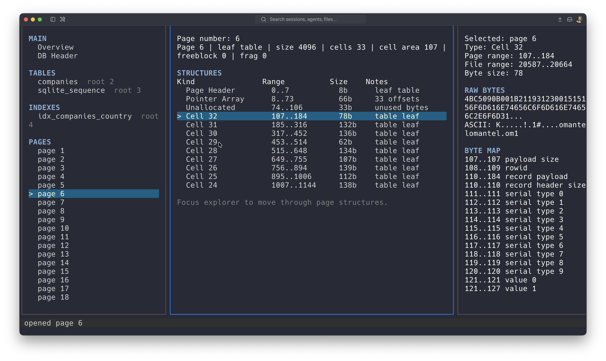

# Badger

Badger is a terminal UI for exploring SQLite database files at the byte and page level.

It is built for people who want to understand how databases store data internally, using SQLite as a practical and approachable example. Badger lets you inspect database headers, pages, b-tree structures, cells, records, payloads, and raw byte ranges directly from the terminal.


## Pre-Alpha Notice

Badger is experimental and changing quickly. Commands, parser behavior, and TUI output may change as the project evolves.

The current focus is read-only inspection of SQLite files. Badger is not a SQL client and does not try to replace the SQLite shell.

## Why Badger Exists

Badger exists to make database file formats easier to learn by showing the physical layout of a real SQLite database. Instead of only reading documentation or querying rows through SQL, you can move through the file structure itself and see how pages, cells, records, and raw bytes fit together.

This project started from the [CodeCrafters](https://codecrafters.io/) [Build your own SQLite](https://app.codecrafters.io/courses/sqlite/overview) course and grew into a standalone explorer for SQLite internals. Huge respect to the CodeCrafters team: their courses are an excellent way to learn real systems by building them step by step. I recommend checking out their [course catalog](https://app.codecrafters.io/catalog).

## Requirements

- Go `1.26.1`
- A terminal with enough space for the TUI panes

## Quick Start

Build the binary:

```bash
make build
```

Run Badger against one of the included fixture databases:

```bash
./bin/badger fixtures/companies.db
```

You can also run it through Go:

```bash
make run ARGS="fixtures/companies.db"
```

## Usage

```text
badger <file.db>
```

Examples:

```bash
./bin/badger fixtures/sample.db
./bin/badger fixtures/companies.db
./bin/badger fixtures/superheroes.db
```

## TUI Navigation

Badger opens directly into an interactive TUI.

The interface has three main areas:

- Left pane: navigation for overview, DB header, tables, indexes, and pages.
- Center pane: the currently selected view, such as database metadata or page structures.
- Right pane: contextual details for the selected item, including byte ranges, raw bytes, byte maps, and decoded fields.



In the page view, the center pane lists page structures such as the page header, pointer array, free space, and cells. Selecting a row shows the related raw bytes and parsed byte map in the details pane.

Keybindings:

| Key | Action |
| --- | --- |
| `tab` | Switch focus between panes |
| `shift+tab` | Switch focus backwards |
| `up` / `down`, `k` / `j` | Move the current selection |
| `enter` | Open the selected navigation item or page |
| `g` | Return to the overview |
| `h` | Open the database header |
| `p` | Jump to the pages list |
| `[` | Open the previous page |
| `]` | Open the next page |
| `q` | Quit |

## What You Can Explore Today

- Database header values, including page size, encoding, schema format, and SQLite version.
- Schema objects from `sqlite_schema`, including tables and indexes.
- Database pages by page number.
- B-tree page headers, pointer arrays, freeblocks, unallocated regions, and cells.
- Table and index cell payloads, including raw hex, ASCII preview, parsed fields, and byte maps.

## Development

Run tests:

```bash
make test
```

Fixture databases for local testing live in `fixtures/`.
