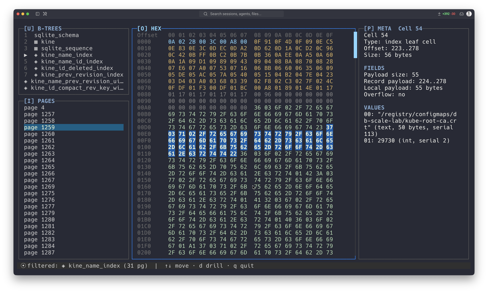

<p align="center">
  
</p>


Badger is a terminal UI for exploring SQLite database files at the byte and page level.

It is built for people who want to understand how databases store data internally, using SQLite as a practical and approachable example. Badger lets you inspect database headers, schema objects, b-tree page sets, pages, cells, records, payloads, and raw byte ranges directly from the terminal.



## Pre-Alpha Notice

Badger is experimental and changing quickly. Commands, parser behavior, and TUI output may change as the project evolves.

The current focus is read-only inspection of SQLite files. Badger is not a SQL client and does not try to replace the SQLite shell.

## Why Badger Exists

Badger exists to make database file formats easier to learn by showing the physical layout of a real SQLite database. Instead of only reading documentation or querying rows through SQL, you can move through the file structure itself and see how pages, cells, records, and raw bytes fit together.

This project started from the [CodeCrafters](https://codecrafters.io/) [Build your own SQLite](https://app.codecrafters.io/courses/sqlite/overview) course and grew into a standalone explorer for SQLite internals. Huge respect to the CodeCrafters team: their courses are an excellent way to learn real systems by building them step by step. I recommend checking out their [course catalog](https://app.codecrafters.io/catalog).

## Requirements

- Go `1.26.1`
- A terminal with enough space for the TUI panes

## Quick Start

Install with Go:

```bash
go install github.com/nikitazigman/badger/cmd/badger@latest
```

Make sure your Go binary directory is on your `PATH`. You can check it with:

```bash
go env GOPATH
```

By default, Go installs binaries into `$(go env GOPATH)/bin`.

Build the binary:

```bash
make build
```

Run Badger against one of the included fixture databases:

```bash
./bin/badger fixtures/companies.db
```

You can also run it through Go:

```bash
make run ARGS="fixtures/companies.db"
```

## Usage

```text
badger <file.db>
```

Examples:

```bash
./bin/badger fixtures/sample.db
./bin/badger fixtures/companies.db
./bin/badger fixtures/superheroes.db
```

## TUI Navigation

Badger opens directly into an interactive TUI.

https://github.com/user-attachments/assets/f069f4f8-37b1-4748-ad33-55c68fe0ae27

The interface has three panes:

- Navigation: `[1] B-TREES` and `[2] PAGES`.
- Detail: `[3]`, the currently selected view. For loaded pages this is `[3] HEX`, a 16-byte-wide hex grid.
- Meta: `[4]`, contextual parsed metadata for the selected navigation item, page, block, or drill range.

The `B-TREES` section merges tables and indexes into one list. It starts with the SQLite-created `sqlite_schema` system catalog at root page 1. Tables use `▦`, indexes use `◈`, and root-page-zero objects use `⊞` because they do not have their own b-tree. The `PAGES` section shows every database page by default.

In the page view, `[3] HEX` shows loaded page bytes as a 16-byte grid. Parsed page blocks are styled and selected by byte range: the database header on page 1, b-tree page header, pointer array, freeblocks, unallocated regions, and table/index cells. `[4] META` shows parsed page, block, or drill metadata; it does not include raw hex dumps or ASCII previews.

When a selected byte range is drillable, `d` drills into it. Cell drill exposes payload size, rowid or left-child page where present, record payload, record header size, serial types, record values, and overflow pointer fields where available. `b` backs out one drill layer or exits drill mode. Footer hints are contextual, so `d drill`, `b back`, and filter hints appear only when they apply.

## Filtering Pages by B-Tree

Badger can scope the `PAGES` list to a single table or index b-tree.

Move to a table or index in `[1] B-TREES` and press `f`. Badger filters `[2] PAGES` to the pages reachable from that object's root page, including interior and leaf b-tree pages. Press `f` again on the active source row to clear the filter, or press `f` on another table/index row to switch it. `esc` also clears the active filter first, and the source row is marked with `▶`.

Filtering is read-only and backed by a b-tree page index built in the background when Badger starts. If indexing has not finished for the selected object, Badger asks you to retry in a moment. If some child pages cannot be parsed, Badger still applies the filter to the pages it could read and reports the skipped pages in the footer.

Filter scope is intentionally narrow:

- Filtering a table shows that table's b-tree pages only; its indexes remain separate.
- Filtering an index shows that index's own b-tree pages only.
- Overflow page chains are not included.
- Root-page-zero objects can be selected and filtered, producing an empty `PAGES` list.

Keybindings:

| Key | Action |
| --- | --- |
| `up` / `down`, `k` / `j` | Move within the focused pane |
| `1` | Focus `[1] B-TREES`, jump to the first b-tree row, and open it |
| `2` | Focus `[2] PAGES`, jump to the first page row, and load it |
| `3` | Focus `[3] Detail` / `[3] HEX` |
| `4` | Focus `[4] Meta` |
| `enter` | Open the selected row when `[1] B-TREES` or `[2] PAGES` is focused |
| `d` | Drill into the selected page block or drill child when available |
| `b` | Back out of the current drill layer |
| `f` | Filter pages to the selected table/index b-tree; clear it on the active source row |
| `esc` | Clear the active filter; when unfiltered, reset page sub-selection/loading state |
| `q` | Quit |

Use `1` through `4` to choose the active view. The `1` and `2` jumps move the navigation cursor between sections and open the selected row. The `3` and `4` jumps only change pane focus; they do not change the selected navigation row or active filter. Navigation arrows are confined to the current section, so use the numbered jumps to move between `B-TREES` and `PAGES`.

## What You Can Explore Today

- Database header values on page 1, including page size, encoding, schema format, and SQLite version.
- Schema objects from `sqlite_schema`, including table and index names, SQL, owning table, and root page.
- Database pages by page number, either across the whole file or filtered to one table/index b-tree.
- B-tree page membership for a table or index, derived by walking interior child pointers from its root page.
- B-tree page headers, pointer arrays, freeblocks, unallocated regions, and cells.
- Table and index cell payload metadata, including parsed fields and drillable record payload internals.

## Development

Run tests:

```bash
make test
```

Fixture databases for local testing live in `fixtures/`.
