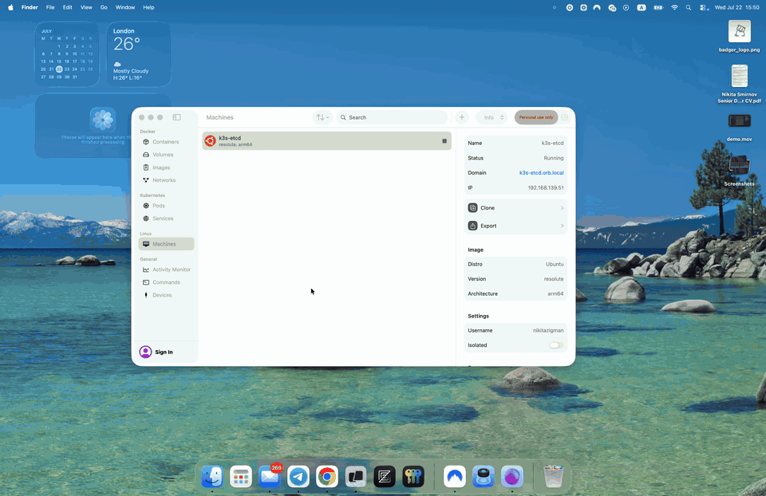
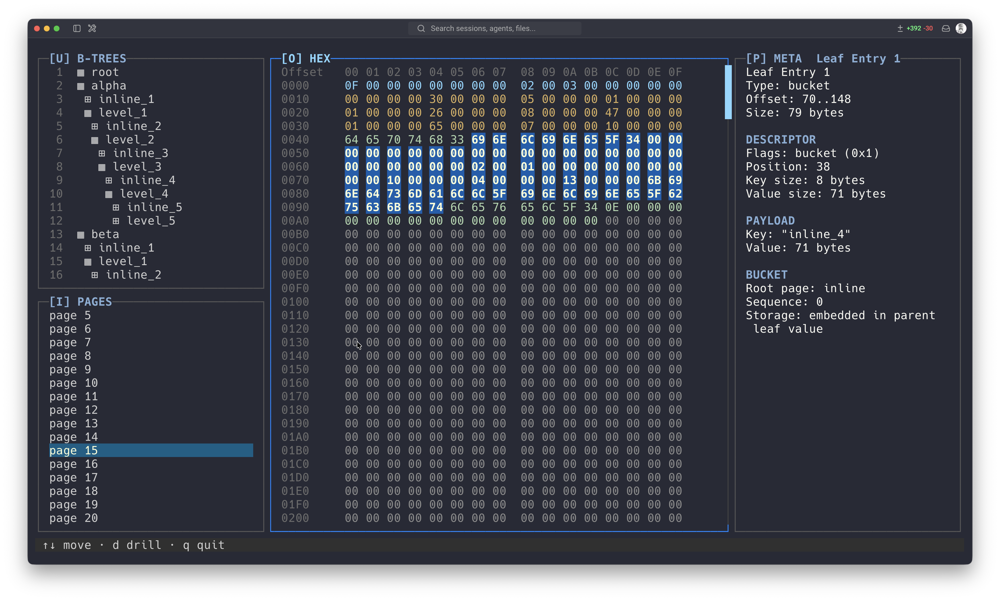

<p align="center">
  
</p>

Badger is a terminal UI for exploring SQLite and bbolt/BoltDB-compatible database files at the byte and page level.

Use it to open a real database file and see how the data is laid out on disk: headers, b-trees, pages, cells, records, buckets, freelist data, overflow pages, continuation pages, and raw byte ranges.

Badger is built for learning, debugging, and inspecting embedded database internals from the terminal. It detects supported formats from file contents, so SQLite and bbolt files do not need special extensions.


## Demo



## Why Use Badger?

- Learn how SQLite and bbolt/BoltDB-compatible files are structured using real database files.
- Inspect storage objects, physical pages, parsed metadata, and matching byte ranges in one TUI.
- Explore bbolt files used by tools such as etcd without writing custom parser code.
- Keep inspection read-only: Badger does not mutate database files.
- See storage structures directly instead of only viewing logical SQL query output or application-level values.

## Requirements

- Go `1.25` or newer
- A terminal with enough space for the TUI panes

## Quick Start

Install with Go:

```bash
go install github.com/nikitazigman/badger/cmd/badger@latest
```

Open a database file:

```bash
badger path/to/database.db
```

Or try one of the included fixtures from a source checkout:

```bash
make build
./bin/badger fixtures/companies.db
./bin/badger fixtures/bbolt/users.db
```

If `badger` is not found after `go install`, make sure your Go binary directory is on your `PATH`:

```bash
go env GOPATH
```

By default, Go installs binaries into `$(go env GOPATH)/bin`.

## Status

Badger is pre-alpha and changing quickly. Commands, parser behavior, and TUI output may change as the project evolves.

The current focus is read-only inspection of SQLite and bbolt/BoltDB-compatible files. Badger is not a SQL client, does not mutate files, and does not decode application-specific bbolt values beyond bbolt-owned storage structures.

## Usage

```text
badger <database-file>
```

You can also run it through Go:

```bash
make run ARGS="fixtures/companies.db"
```

Examples:

```bash
./bin/badger fixtures/sample.db
./bin/badger fixtures/companies.db
./bin/badger fixtures/superheroes.db
./bin/badger fixtures/bbolt/users.db
./bin/badger fixtures/bbolt/nested_inline.db
./bin/badger fixtures/bbolt/overflow.db
```

## Supported Formats

Badger detects supported engines from the file contents, not just the filename.

SQLite support covers ordinary SQLite database files, including the database header, schema objects, table and index b-trees, page bytes, cells, records, payload metadata, and b-tree page filtering.

bbolt support covers bbolt/BoltDB-compatible database files with valid meta pages. A bbolt file does not need a special extension. Badger opens it read-only, selects the active meta configuration, lists zero-based physical pages, and shows buckets as storage objects in `[U] B-TREES`.



For bbolt databases, Badger can inspect meta pages, freelist pages, branch pages, leaf pages, bucket entries, nested buckets, inline buckets, overflow-backed pages, continuation pages, descriptor fields, and byte spans. Application values remain opaque raw bytes; Badger decodes bbolt-owned storage structures but does not infer application payload schemas.

## TUI Navigation

Badger opens directly into an interactive TUI.

The interface has four key-labeled sections across three visual panes:

- Navigation: `[U] B-TREES` and `[I] PAGES`.
- Detail: `[O]`, the currently selected view. For loaded pages this is `[O] HEX`, a 16-byte-wide hex grid.
- Meta: `[P]`, contextual parsed metadata for the selected navigation item, page, block, or drill range.

The `B-TREES` section is storage-object first. For SQLite, it merges tables and indexes into one list and starts with the SQLite-created `sqlite_schema` system catalog at root page 1. Tables use `▦`, indexes use `◈`, and root-page-zero objects use `⊞` because they do not have their own b-tree. For bbolt, `B-TREES` shows the root bucket, top-level buckets, nested buckets, and inline buckets. Physical buckets use `▦`; inline buckets use `⊞` because their bytes are embedded in a parent leaf value rather than stored at their own physical root page.

The `PAGES` section shows every engine-native physical page by default. SQLite pages are one-based. bbolt pages are zero-based, so page `0` starts at file offset `0` and the unfiltered list is bounded by the active bbolt high-water page count.

In the page view, `[O] HEX` shows loaded page bytes as a 16-byte grid. Parsed page blocks are styled and selected by byte range. SQLite blocks include the database header on page 1, b-tree page header, pointer array, freeblocks, unallocated regions, and table/index cells. bbolt blocks include page headers, meta payloads, freelist payloads, branch descriptors, leaf descriptors, leaf entries, keys, values, bucket header fields, inline bucket page structures, and overflow extents. `[P] META` shows parsed page, block, or drill metadata; it does not include raw hex dumps or ASCII previews.

When a selected byte range is drillable, `d` drills into it. SQLite cell drill exposes payload size, rowid or left-child page where present, record payload, record header size, serial types, record values, and overflow pointer fields where available. bbolt drill exposes branch and leaf descriptors, descriptor fields, keys, values, `InBucket` root page and sequence fields, embedded inline page headers and leaf entries, freelist ids, and continuation-page overflow extents where available. `b` backs out one drill layer or exits drill mode. Footer hints are contextual, so `d drill`, `b back`, and filter hints appear only when they apply.

## Filtering Pages by Storage Object

Badger can scope the `PAGES` list to a single storage object.

Move to an object in `[U] B-TREES` and press `f`. Badger filters `[I] PAGES` to that object's physical page set. Press `f` again on the active source row to clear the filter, or press `f` on another row to switch it. `esc` also clears the active filter first, and the source row is marked with `▶`. The footer shows the active filter source and filtered page count.

Filtering is read-only and backed by a b-tree page index built in the background when Badger starts. If indexing has not finished for the selected object, Badger asks you to retry in a moment.

SQLite filter scope is intentionally narrow:

- Filtering a table shows that table's b-tree pages only; its indexes remain separate.
- Filtering an index shows that index's own b-tree pages only.
- Overflow page chains are not included.
- Root-page-zero objects can be selected and filtered, producing an empty `PAGES` list.

bbolt filter scope follows physical bucket reachability:

- Filtering a physical bucket shows the branch and leaf pages reachable from that bucket's root page.
- Filtering includes continuation pages for reachable overflow-backed bbolt pages.
- Filtering an inline bucket shows the parent physical page that contains the inline bucket value.
- Duplicate bucket names are handled by stable bucket paths, so similarly named nested or inline buckets can be filtered independently.

Keybindings:

| Key | Action |
| --- | --- |
| `up` / `down`, `k` / `j` | Move one row within the focused pane |
| `Nj` / `Nk` / `Ngg` | Move `N` visible rows down/up with `Nj` / `Nk`; jump directly to visible page `N` in `[I] PAGES` or visible B-tree row `N` in `[U] B-TREES` with `Ngg` |
| `U` | Focus `[U] B-TREES`, preserving the current b-tree row when possible, and open it |
| `I` | Focus `[I] PAGES`, preserving the current page row when possible, and load it |
| `O` | Focus `[O] Detail` / `[O] HEX` |
| `P` | Focus `[P] Meta` |
| `enter` | Open the selected row when `[U] B-TREES` or `[I] PAGES` is focused |
| `gg` | Jump to the first visible row in the active `[U] B-TREES` or `[I] PAGES` list |
| `ge` | Jump to the last visible row in the active `[U] B-TREES` or `[I] PAGES` list |
| `u` | Move up 10 rows in `[U] B-TREES` or `[I] PAGES` and open/load the selected row; numeric prefixes before `u` are rejected |
| `d` | Move down 10 rows in `[U] B-TREES` or `[I] PAGES`; drill into the selected page block or drill child when `[O] HEX` or `[P] META` is focused; numeric prefixes before `d` are rejected |
| `b` | Back out of the current drill layer |
| `f` | Filter pages to the selected storage object; clear it on the active source row |
| `esc` | Clear the active filter; when unfiltered, reset page sub-selection/loading state |
| `q` | Quit |

Use uppercase `U`, `I`, `O`, and `P` to choose the active view. The `U` and `I` jumps move the navigation cursor between sections, preserve the current b-tree or page selection when it is still visible, and open the selected row. The `O` and `P` jumps only change pane focus; they do not change the selected navigation row or active filter. Navigation arrows are confined to the current section, so use the pane jumps to move between `B-TREES` and `PAGES`.

## What You Can Explore Today

SQLite support includes:

- Database header values on page 1, including page size, encoding, schema format, and SQLite version.
- Schema objects from `sqlite_schema`, including table and index names, SQL, owning table, and root page.
- Database pages by page number, either across the whole file or filtered to one table/index b-tree.
- B-tree page membership for a table or index, derived by walking interior child pointers from its root page.
- B-tree page headers, pointer arrays, freeblocks, unallocated regions, and cells.
- Table and index cell payload metadata, including parsed fields and drillable record payload internals.

bbolt support includes:

- bbolt/BoltDB-compatible files detected by valid meta pages after SQLite detection fails.
- Active meta configuration, page size, root page, freelist page, high-water mark, transaction ID, and page counts.
- Zero-based physical pages, including meta, freelist, branch, leaf, free, continuation, unknown, and truncated page classifications.
- Root, top-level, nested, and inline bucket rows in `[U] B-TREES`.
- Bucket entry keys, raw values, `InBucket` headers, root page and sequence fields, and parent page/entry context for inline buckets.
- Inline bucket bytes embedded inside parent leaf values, including drillable embedded page headers, descriptors, and leaf entries.
- Overflow-backed logical pages and continuation pages, including parent page, part number, logical extent, and selected physical span metadata.

bbolt application values are intentionally kept opaque as raw bytes. Badger decodes bbolt-owned structures, but it does not infer application payload schemas.

## Why Badger Exists

Badger exists to make database file formats easier to learn by showing the physical layout of real embedded databases. Instead of only reading documentation or querying rows through SQL or an application API, you can move through the file structure itself and see how pages, cells, records, buckets, and raw bytes fit together.

This project started from the [CodeCrafters](https://codecrafters.io/) [Build your own SQLite](https://app.codecrafters.io/courses/sqlite/overview) course and grew into a standalone explorer for SQLite internals. Huge respect to the CodeCrafters team: their courses are an excellent way to learn real systems by building them step by step. I recommend checking out their [course catalog](https://app.codecrafters.io/catalog).

## Development

Run tests:

```bash
make test
```

Fixture databases for local testing live in `fixtures/`.
